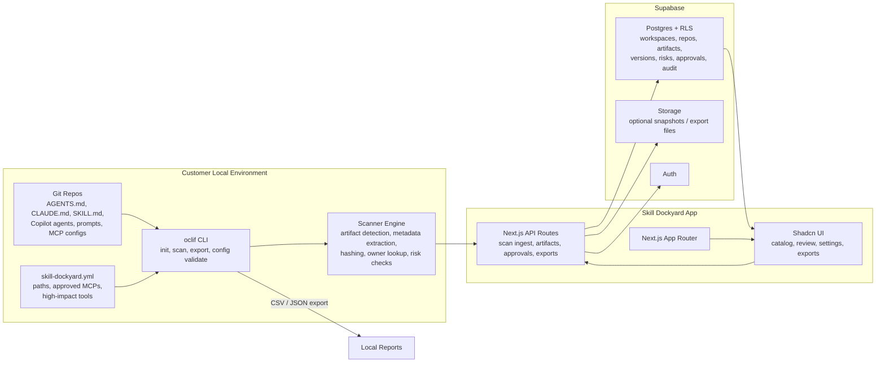

# Skill Dockyard

Skill Dockyard is a Git-native governance layer for AI artifacts: `AGENTS.md`, `CLAUDE.md`, `SKILL.md`, Copilot agents, prompt folders, Cursor rules, and MCP configs.

## MVP Stack

- Next.js App Router
- Shadcn-style UI components
- Supabase Auth, Postgres, RLS, and optional Storage
- oclif CLI for local scanning and export

## Getting Started

### 1. Install dependencies

```bash
npm install
```

### 2. Start the web app

```bash
npm run dev
```

Open [http://localhost:3000](http://localhost:3000). If Supabase environment variables are not configured yet, the app uses built-in demo data so you can still explore the catalog, artifact detail, review, and export screens.

### 3. Validate the scanner config

The starter config lives in `skill-dockyard.yml` and points at the included fixture repo.

```bash
npm run cli -- config validate --path skill-dockyard.yml
```

### 4. Run a local scan

```bash
npm run cli -- scan --repo tests/fixtures/sample-repo
```

Use JSON output when you want to inspect the full scanner payload:

```bash
npm run cli -- scan --repo tests/fixtures/sample-repo --json
```

### 5. Export governance data

```bash
npm run cli -- export --repo tests/fixtures/sample-repo --format json --output skill-dockyard-export.json
npm run cli -- export --repo tests/fixtures/sample-repo --format csv --output skill-dockyard-export.csv
```

The web app also exposes downloads at `/exports`.

### 6. Scan your own repo

Update `skill-dockyard.yml` with your repo path, approved MCP servers, and high-impact tools, then run:

```bash
npm run cli -- scan
```

To send scan results into a running local app API:

```bash
npm run cli -- scan --endpoint http://localhost:3000/api/scan
```

## Supabase

Create a project and apply:

```bash
supabase/migrations/0001_initial_schema.sql
```

The app falls back to fixture data when Supabase environment variables are not set, so the product surface is explorable before backend setup.

## Architecture


