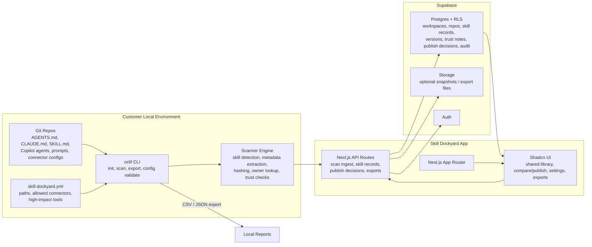

# Skill Dockyard

Skill Dockyard is a shared skill library for teams: scan `AGENTS.md`, `CLAUDE.md`, `SKILL.md`, Copilot agents, prompt folders, Cursor rules, and connector configurations, then preserve the improvements worth publishing back to the team.

## MVP Stack

- Next.js App Router
- Shadcn-style UI components
- Supabase Auth, Postgres, RLS, and optional Storage
- oclif CLI for local scanning and export

## Getting Started

### 1. Install dependencies

```bash
npm install
```

### 2. Start the web app

```bash
npm run dev
```

Open [http://localhost:3000](http://localhost:3000). The public landing page explains the product; use [/demo](http://localhost:3000/demo) to explore fixture data without an account. The private app lives at [/app](http://localhost:3000/app).

### Page and code checks

Run the fast unit suite with `npm test`. Run the full page smoke suite with `npm run test:pages`; it builds the production app, starts it without external Supabase access, checks public and demo pages, verifies internal links, and then shuts the server down.

### 3. Submit a skill without Git

Open [http://localhost:3000/app/submit](http://localhost:3000/app/submit) to add a new skill, or open [http://localhost:3000/app/submit/update](http://localhost:3000/app/submit/update) to propose an update:

- **Add a new skill** to paste instructions that should become part of the shared library.
- **Propose an update** to start from an existing skill and suggest an improved version.

Skill Dockyard checks the pasted content for trust notes and prepares it for comparison. In the demo, submissions are local browser drafts. In the authenticated app, submissions save to the account's private workspace; publishing still happens from the Compare Versions page.

### 4. Clone the example repo

Skill Dockyard works best when you start with a real Git repo. The example repo contains safe sample agent docs, Claude skills, Copilot agents, prompts, Cursor rules, and connector configuration.

```bash
git clone https://github.com/weber-stephen/skill-dockyard-example-repo.git ../skill-dockyard-example-repo
```

This project also keeps the same seed content in `examples/skill-dockyard-example-repo` so the example can be maintained alongside the scanner tests.

### 5. Validate the scanner config

The starter config lives in `skill-dockyard.yml` and points at `../skill-dockyard-example-repo`.

```bash
npm run cli -- config validate --path skill-dockyard.yml
```

### 6. Run a local scan

Run scanner commands from the Skill Dockyard app checkout, not from inside the example repo.

```bash
# Run from the Skill Dockyard app checkout, not from inside the example repo.
npm run cli -- scan --repo ../skill-dockyard-example-repo
```

Use JSON output when you want to inspect the full scanner payload:

```bash
# Run from the Skill Dockyard app checkout, not from inside the example repo.
npm run cli -- scan --repo ../skill-dockyard-example-repo --json
```

### 7. Export skill inventory data

```bash
# Run from the Skill Dockyard app checkout, not from inside the example repo.
npm run cli -- export --repo ../skill-dockyard-example-repo --format json --output skill-dockyard-export.json
npm run cli -- export --repo ../skill-dockyard-example-repo --format csv --output skill-dockyard-export.csv
```

The web app also exposes downloads at `/exports`.

### 8. Scan your own repo

Update `skill-dockyard.yml` with your repo path, allowed connectors, and high-impact tools, then run:

```bash
npm run cli -- scan
```

To send scan results into a running local app API:

```bash
npm run cli -- scan --endpoint http://localhost:3000/api/scan --token "$SKILL_DOCKYARD_INGEST_TOKEN"
```

### Import and update skills from Codex or Claude Code

Open **Getting started → Import existing skills** and create a one-time pairing code. Then run the displayed commands from any Terminal window:

```bash
npx skill-dockyard connect --endpoint https://your-skill-dockyard --code YOUR_PAIRING_CODE
npx skill-dockyard import
```

The pairing code works once and expires after ten minutes. The resulting connection can be revoked from **Workspace settings → Connected computers**. It can import, download, and report your own installations, but cannot publish skills or manage access.

To check or install approved updates:

```bash
npx skill-dockyard check
npx skill-dockyard update --all
```

The updater refuses to overwrite local edits. Install the optional agent helper with `npx skill-dockyard install-helper --target codex` or `--target claude-code` so you can ask your agent to check updates on demand.

## Example repo

The public example repo lives at [github.com/weber-stephen/skill-dockyard-example-repo](https://github.com/weber-stephen/skill-dockyard-example-repo). The source seed content lives in `examples/skill-dockyard-example-repo`.

To push seed updates to GitHub:

```bash
cd examples/skill-dockyard-example-repo
git init
git add .
git commit -m "Update Skill Dockyard example skills"
git branch -M main
git remote add origin https://github.com/weber-stephen/skill-dockyard-example-repo.git
git push -u origin main
```

## Supabase

Create a project and apply every migration in filename order:

```bash
supabase/migrations/0001_initial_schema.sql
supabase/migrations/0002_personal_workspaces.sql
supabase/migrations/0003_workspace_settings_repair.sql
supabase/migrations/20260901023409_onboarding_and_scan_tokens.sql
supabase/migrations/20260902120000_artifact_sharing.sql
supabase/migrations/20260903041344_permission_model.sql
supabase/migrations/20260904233130_proposal_lifecycle.sql
supabase/migrations/20260907090000_private_skill_visibility.sql
supabase/migrations/20260909100000_workspace_membership_admin.sql
```

The `/demo` route uses fixture data so the product surface is explorable before backend setup. The authenticated `/app` route requires the Supabase environment variables and shows a configuration screen when the live workspace is not connected.

### Environment variables

Copy `.env.example` to `.env.local` or `.env`, then fill in these values from your Supabase project:

```bash
NEXT_PUBLIC_SUPABASE_URL=
NEXT_PUBLIC_SUPABASE_PUBLISHABLE_KEY=
SUPABASE_SERVICE_ROLE_KEY=
NEXT_PUBLIC_SITE_URL=http://localhost:3000
SKILL_DOCKYARD_INGEST_TOKEN=
SKILL_DOCKYARD_INGEST_WORKSPACE_ID=
```

| Variable | Where to get it | Notes |
| --- | --- | --- |
| `NEXT_PUBLIC_SUPABASE_URL` | Supabase Dashboard -> your project -> Project Settings -> API -> Project URL | This is safe to expose to the browser. The app uses it to connect to Supabase. |
| `NEXT_PUBLIC_SUPABASE_PUBLISHABLE_KEY` | Supabase Dashboard -> Connect | Browser-safe key used only for email/password authentication. |
| `SUPABASE_SERVICE_ROLE_KEY` | Supabase Dashboard -> your project -> Project Settings -> API -> Project API keys -> `service_role` / `secret` key | Keep this server-only. Required for live Supabase mode because prototype API routes write through service-role-only RLS policies. |
| `NEXT_PUBLIC_SITE_URL` | Your deployed app URL | Add `/auth/confirm` to Supabase Auth Redirect URLs and set the Confirm signup template to `{{ .SiteURL }}/auth/confirm?token_hash={{ .TokenHash }}&type=email`. |
| `SKILL_DOCKYARD_INGEST_TOKEN` | Generate a long random value | Required by the CLI scan endpoint. Keep server-only. |
| `SKILL_DOCKYARD_INGEST_WORKSPACE_ID` | UUID of a workspace intended for CLI ingest | Required for a scanner connector; browser users receive their own workspace automatically. |

## Architecture


