# Skill Dockyard user flows

These diagrams describe the current product behavior in the app. They were regenerated from the routes and API handlers under `src/app`, the UI components under `src/components`, and the access rules in `src/lib/access.ts`.

## Flow index

| Flow | Entry point | Primary roles |
| --- | --- | --- |
| Account access | `/signup`, `/login` | Visitor |
| First-run setup | `/getting-started` | Workspace member |
| Import installed skills | `/getting-started#scanner`, CLI | Workspace member |
| Add a new skill | `/app/submit` or `/demo/submit` | Workspace member or demo visitor |
| Propose an update | `/artifacts/:id` → `/artifacts/:id/update` or `/submit/update` | Owner, reviewer, editor, proposer-share recipient |
| Review and publish | `/review-queue`, `/artifacts/:id/review` | Owner or reviewer |
| Share a skill | `/artifacts/:id` | Owner or reviewer |
| Accept or decline a share | `/invites` | Invite recipient |
| Download a published skill | `/artifacts/:id` | Any user with access |
| Configure trust and scanner settings | `/settings/repos`, `/settings/risk-rules` | Workspace member |
| Export inventory | `/exports` | Workspace member |
| Track proposal activity | `/submissions`, `/notifications` | Submitter or reviewer |

## 1. Account access

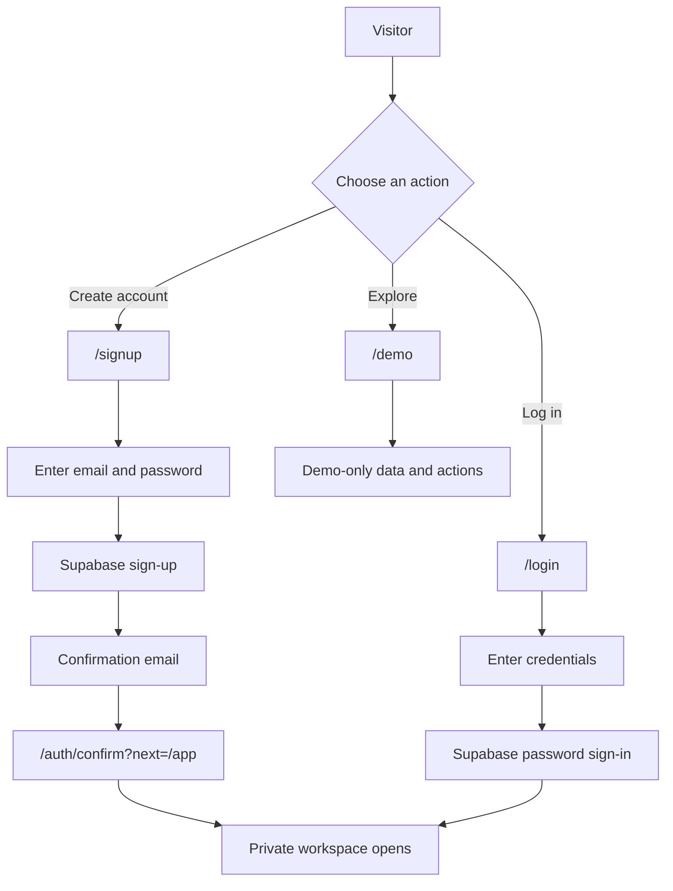

## 2. First-run setup

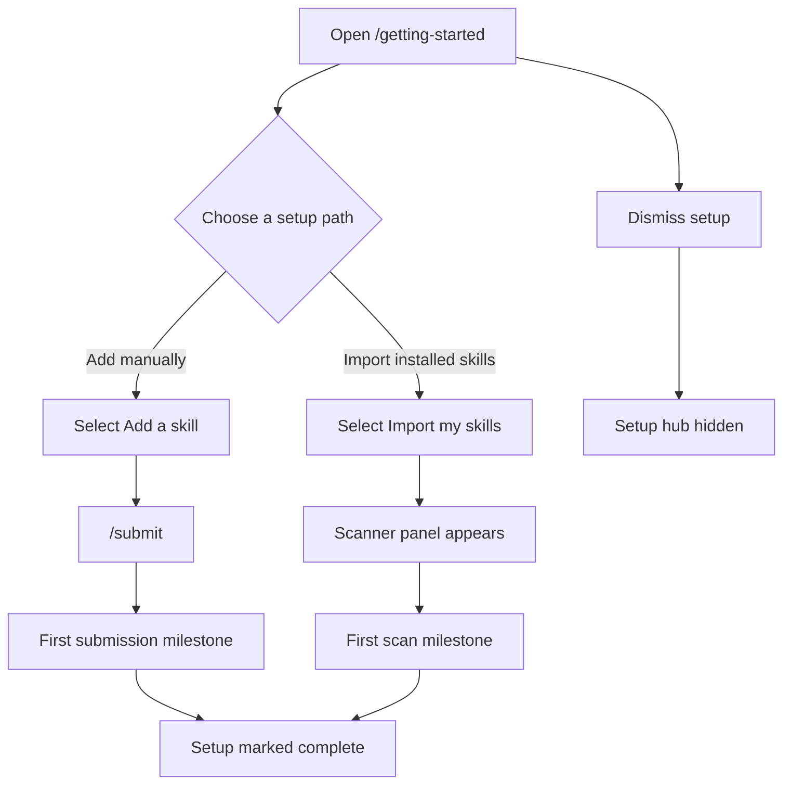

## 3. Import installed skills

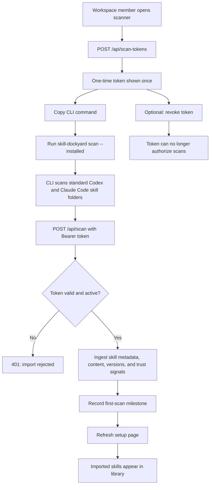

## 4. Add a new skill in the demo

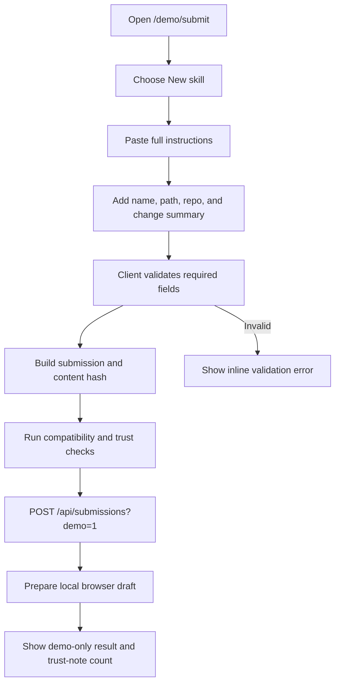

## 5. Add a new skill to the live workspace

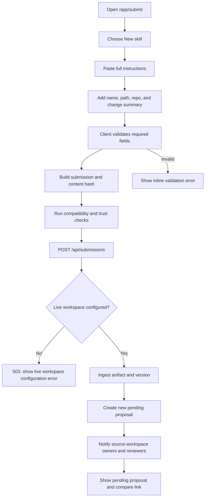

## 6. Propose an update to a shared skill

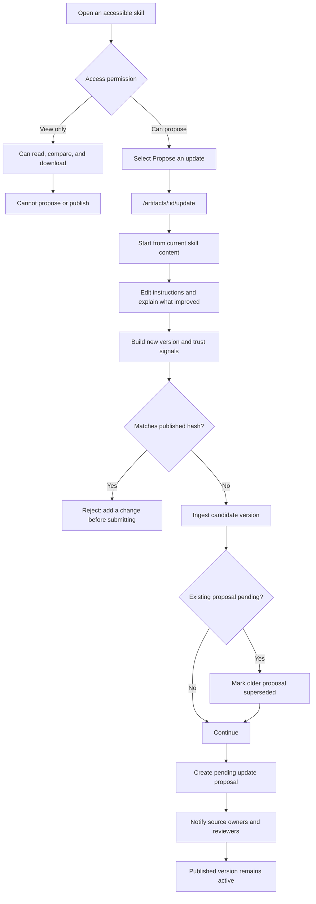

## 6a. Save and promote a private draft

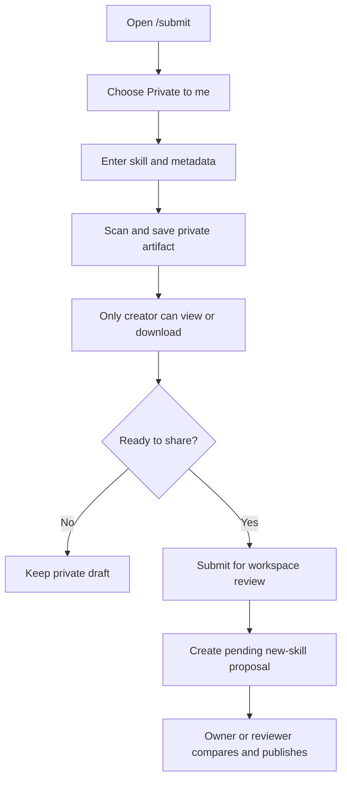

## 7. Review and publish a proposal

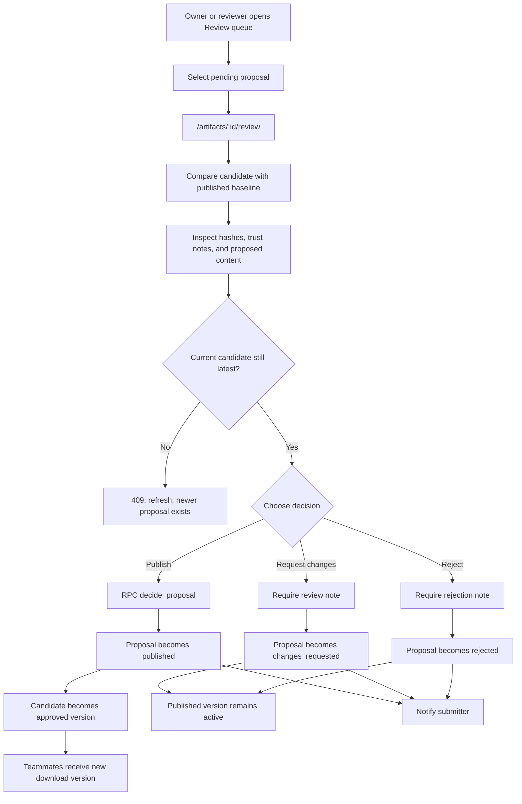

## 8. Share a skill

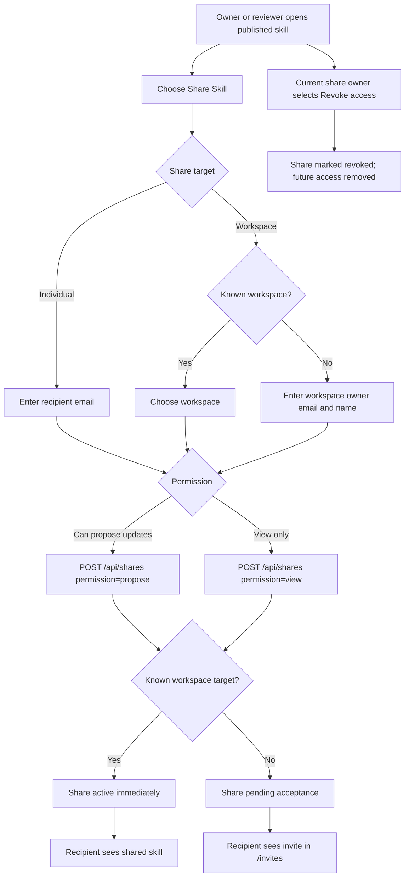

## 9. Accept or decline a share invite

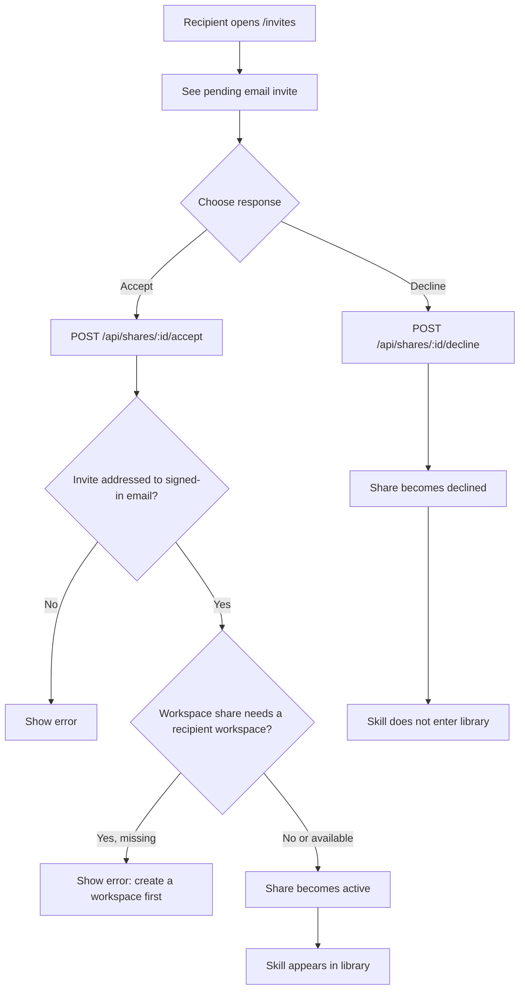

## 10. Download a published skill

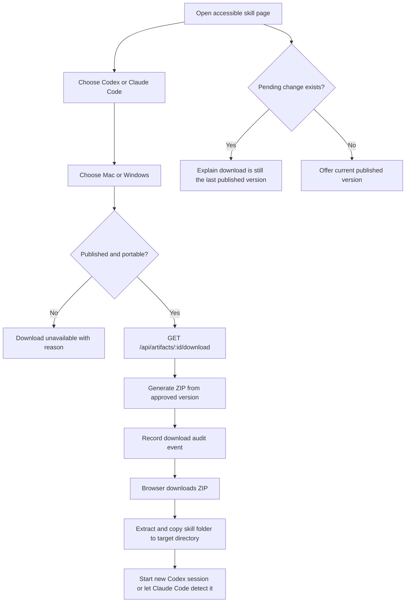

## 11. Configure scanner and trust rules

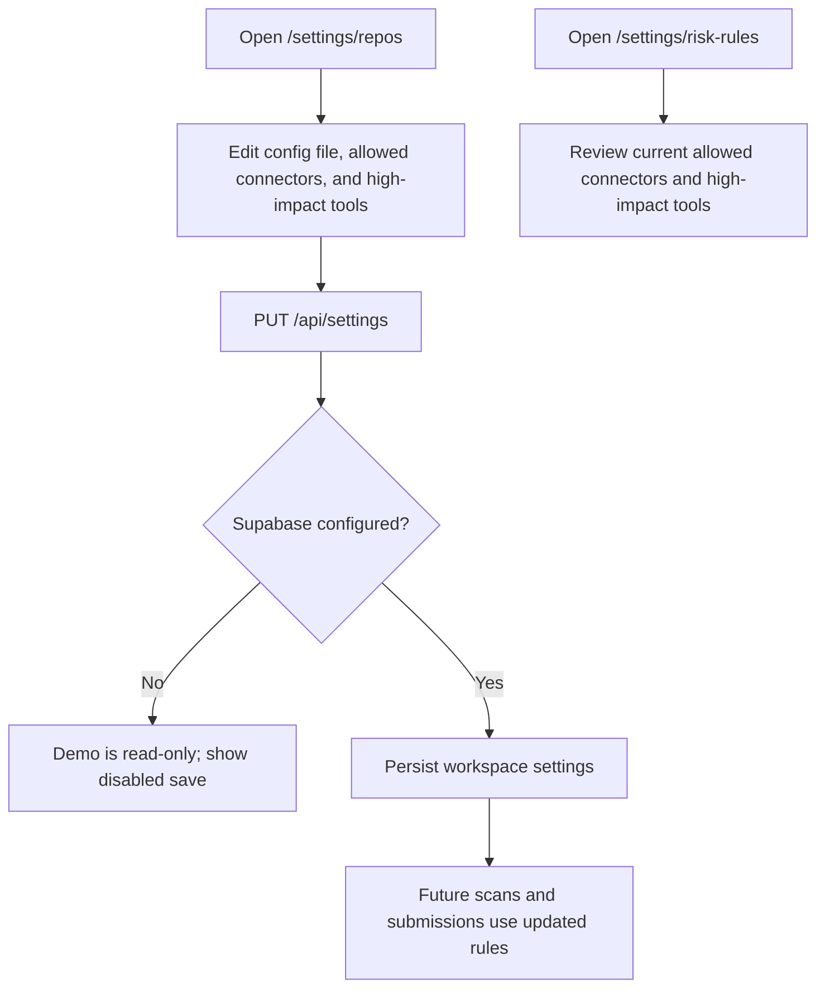

## 12. Export the skill inventory

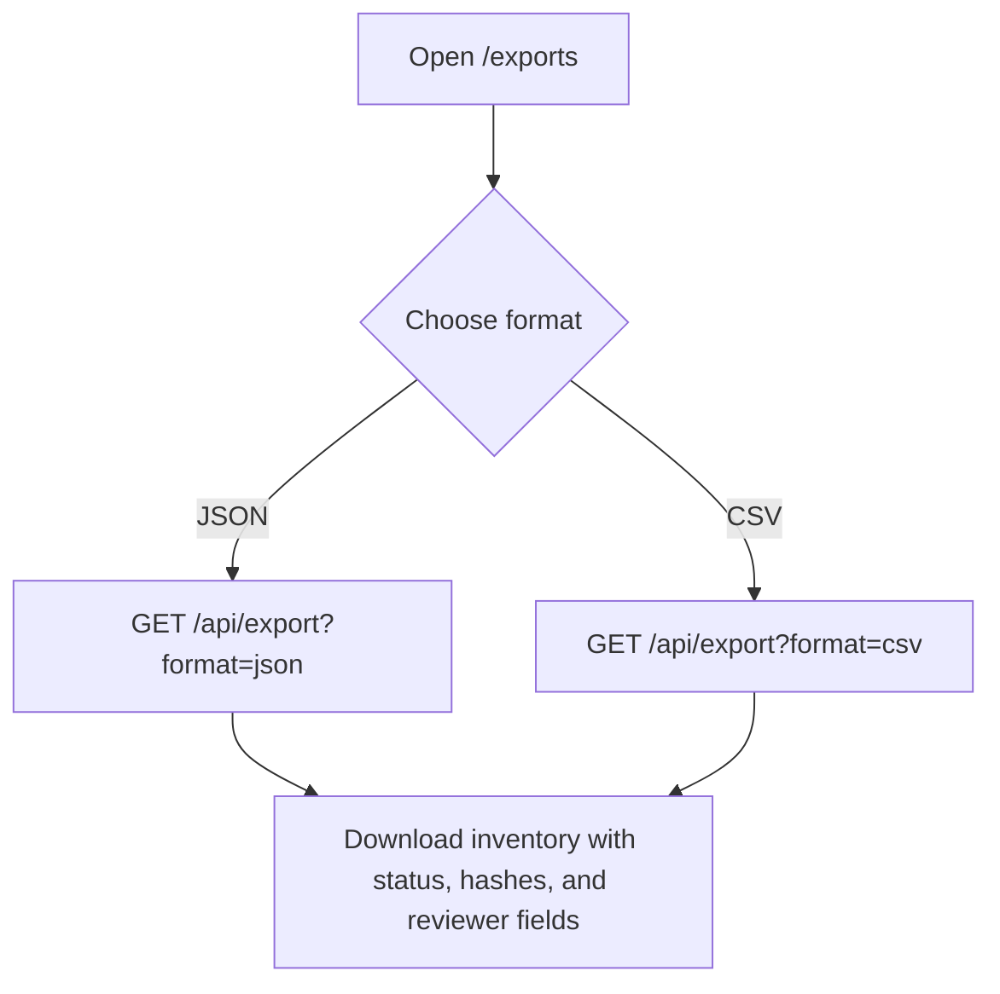

## 13. Track proposal activity

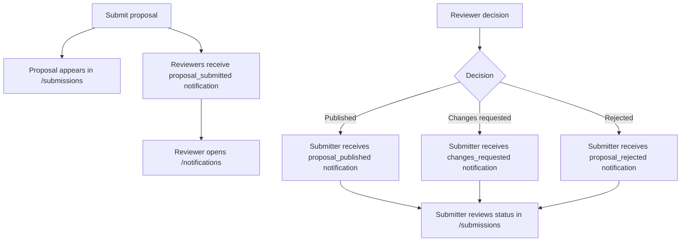

## Permission invariants represented in the flows

- Sharing never transfers ownership.
- Only source-workspace owners and reviewers can publish, manage shares, or revoke shares.
- New skills can be saved as creator-only private drafts or submitted directly as workspace proposals.
- Private drafts cannot be shared, reviewed, or published until the creator submits them for workspace review.
- Owners, reviewers, editors, and recipients with `propose` permission may propose updates; view-only recipients may not.
- A proposal is not published until an owner or reviewer explicitly chooses Publish.
- Requesting changes or rejecting a proposal leaves the last published version active.
- Revoking a share removes future access while preserving the skill and its audit history.
- Workspace membership invites are distinct from skill shares and default to Viewer.
- Only the owner can create/revoke membership invites or rename the workspace; invite links are hashed, expire after seven days, and require a matching verified email.
- Adding a member never exposes another creator’s private draft.

## 14. Invite a workspace member

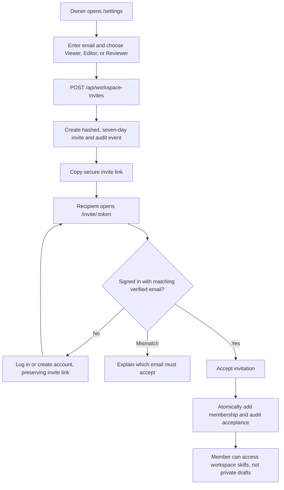

## 15. Rename a workspace

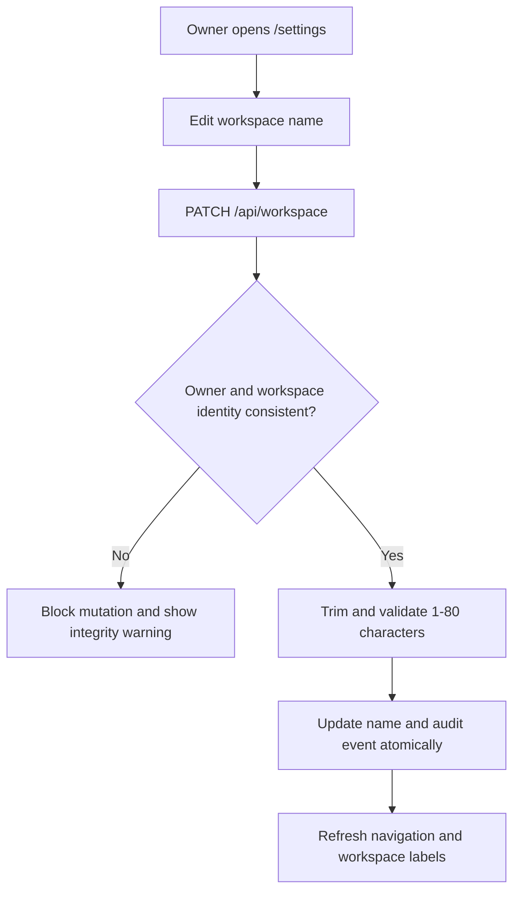
